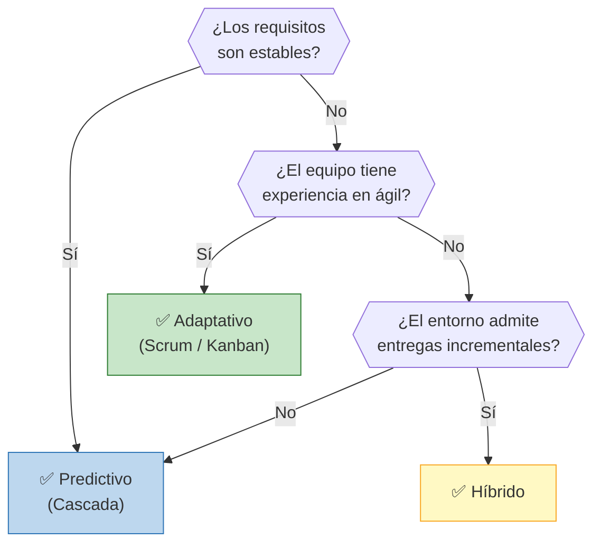
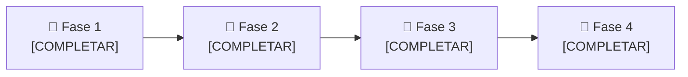

# 🔄 Ciclo de Vida del Proyecto en la etapa 1:

## Enfoque seleccionado 

> **Predictivo**

## Justificación de la elección

> La etapa inicial del proyecto se ejecutará con un enfoque predictivo, ya que desde el principio se pueden establecer los objetivos y requerimientos. Se pueden definir las distintas etapas y son relativamente estables.

## Árbol de decisión

> **Decisión del grupo:** La rama del arbol que aplica a la primer etapa es la PRIDICTIVA, ya que los requisitos para construir el programa en realidad virtual son estables, ya que sería mostrar un modelo del cuerpo humano manipulable a traves de los hápticos.

# 🔄 Ciclo de Vida del Proyecto en la etapa 2:

## Enfoque seleccionado

> **Adaptativo**

## Justificación de la elección

> La segunda etapa del proyecto tendrá un enfoque adaptativo, ya que está sujeta a cambios dependiendo de la retroalimentación con usuarios.

## Árbol de decisión

> **Decisión del grupo:**  La rama del arbol que aplica a la segunda etapa es la ADAPTATIVA, ya que los requisitos no son estables porque los usuarios que entrenarán con el simulador podrán proponer mejoras durante su uso. Además, el equipo sí tendrá experiencia en ágil ya que la adaptación al cambio es rápida y la colaboración se mantiene constante. 

## Fases del proyecto

| Fase | Nombre | Objetivo | Criterio de salida |
|------|--------|----------|-------------------|
| 1 | [COMPLETAR] | [COMPLETAR] | [COMPLETAR] |
| 2 | [COMPLETAR] | [COMPLETAR] | [COMPLETAR] |
| 3 | [COMPLETAR] | [COMPLETAR] | [COMPLETAR] |
| 4 | [COMPLETAR] | [COMPLETAR] | [COMPLETAR] |

---

*Cátedra Gestión de Proyectos · FIUNER · 2026*
