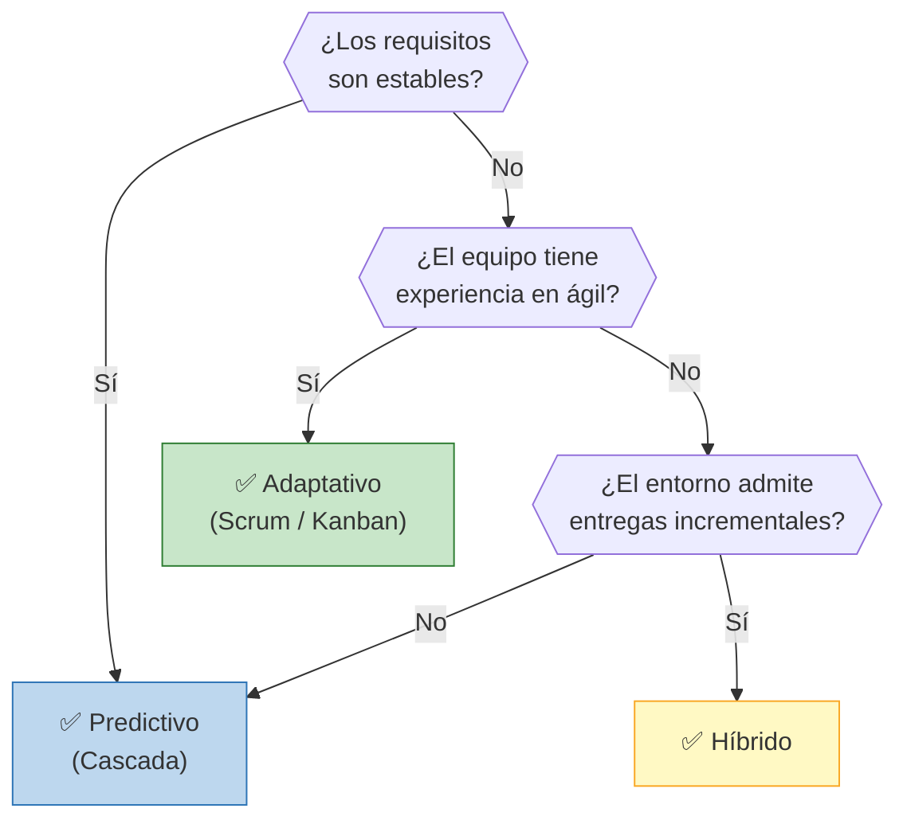
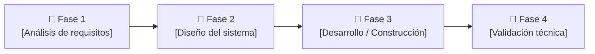
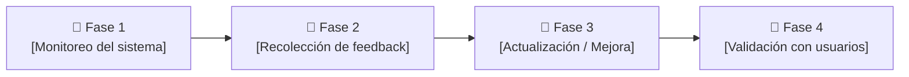

# 🔄 Ciclo de Vida del Proyecto en la etapa 1:

## Enfoque seleccionado 

> **Predictivo**

## Justificación de la elección

> En la etapa de producción se adopta un enfoque predictivo debido a que el proyecto presenta un bajo nivel de incertidumbre y requiere una planificación detallada desde el inicio. En este contexto, los objetivos, requisitos y resultados esperados están bien definidos, lo que permite establecer un plan estructurado y seguirlo de manera secuencial.
> 
> Además, el nivel de riesgo es alto, ya que existe una inversión significativa asociada al desarrollo. Esto hace necesario minimizar errores y retrabajos, lo cual se logra mediante una planificación anticipada rigurosa. El enfoque predictivo permite controlar mejor los tiempos, costos y recursos, asegurando que el producto final cumpla con los estándares requeridos.
> 
> Por otro lado, la retroalimentación proviene principalmente del asesor médico, lo que implica que las decisiones se basan en criterios técnicos y especializados previamente definidos, reforzando la necesidad de un desarrollo más controlado y menos flexible.
> 
> Finalmente, aunque se entregan múltiples versiones del producto, estas responden a una planificación previa y no a cambios constantes, lo que es característico de un enfoque predictivo.

## Árbol de decisión

> **Decisión del grupo:** La rama del arbol que aplica a la primer etapa es la PRIDICTIVA, ya que los requisitos para construir el programa en realidad virtual son estables, ya que sería mostrar un modelo del cuerpo humano manipulable a traves de los hápticos.

## Fases del proyecto

| Fase | Nombre | Objetivo | Criterio de salida |
|------|--------|----------|-------------------|
| 1 | Análisis de requisitos | Definir las necesidades del sistema junto con el asesor médico | Requisitos documentados y validados |
| 2 | Diseño del sistema | Establecer la arquitectura, componentes y funcionamiento del equipo| Diseño aprobado |
| 3 | Desarrollo / Construcción | Implementar y ensamblar el sistema según el diseño | Prototipo funcional construido |
| 4 | Validación técnica | Verificar que el sistema cumpla con los requisitos definidos | Sistema validado por el asesor médico |

---

# 🔄 Ciclo de Vida del Proyecto en la etapa 2:

## Enfoque seleccionado

> **Adaptativo**

## Justificación de la elección

> En la etapa de mantenimiento se opta por un enfoque adaptativo debido al alto nivel de incertidumbre asociado a los cambios que pueden surgir durante el uso del sistema. A diferencia de la etapa de producción, aquí el producto ya está en funcionamiento y es utilizado por usuarios reales, lo que genera nuevas necesidades y ajustes continuos.
> 
> El nivel de riesgo es bajo, lo que permite implementar cambios de manera más flexible sin comprometer significativamente la estabilidad del sistema. Esto favorece un enfoque iterativo e incremental, donde se realizan múltiples entregas basadas en mejoras y actualizaciones.
> 
> La retroalimentación en esta etapa proviene directamente de los usuarios, lo cual es clave para adaptar el sistema a sus necesidades reales. Este tipo de feedback es dinámico y muchas veces impredecible, lo que refuerza la necesidad de un enfoque adaptable.
> 
> En consecuencia, el desarrollo se orienta a responder rápidamente a los cambios, priorizando la mejora continua y la capacidad de adaptación por sobre la planificación rígida, características centrales del enfoque adaptativo.

## Árbol de decisión

> **Decisión del grupo:**  La rama del arbol que aplica a la segunda etapa es la ADAPTATIVA, ya que los requisitos no son estables porque los usuarios que entrenarán con el simulador podrán proponer mejoras durante su uso. Además, el equipo sí tendrá experiencia en ágil ya que la adaptación al cambio es rápida y la colaboración se mantiene constante. 

## Fases del proyecto

| Fase | Nombre | Objetivo | Criterio de salida |
|------|--------|----------|-------------------|
| 1 | Monitoreo del sistema | Evaluar el desempeño del sistema en uso real | Datos de uso y problemas identificados |
| 2 | Recolección de feedback | Obtener sugerencias y necesidades de los usuarios | Feedback documentado |
| 3 | Actualización / Mejora | Implementar cambios y mejoras en el sistema | Versión actualizada del sistema |
| 4 | Validación con usuarios | Verificar que las mejoras resuelvan los problemas detectados | Aprobación de los usuarios y correcto funcionamiento |

---

*Cátedra Gestión de Proyectos · FIUNER · 2026*
