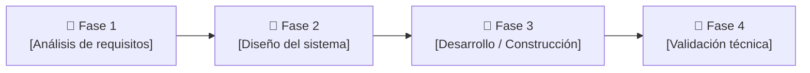
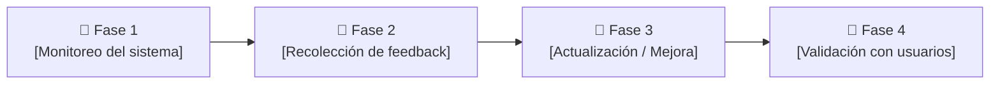

# 🔄 Ciclo de Vida del Proyecto:

## Enfoque seleccionado 

> **HÍBRIDO**

## Justificación de la elección

>Se adopta un enfoque híbrido debido a que el proyecto combina características de entornos con baja incertidumbre (donde es posible definir ciertos requisitos desde el inicio) con otros aspectos más complejos y cambiantes que requieren flexibilidad. En este contexto, algunas partes del proyecto pueden planificarse de manera estructurada, mientras que otras necesitan evolucionar progresivamente a medida que se obtiene nueva información.
>
>Por un lado, se establecen componentes del proyecto con un enfoque predictivo, especialmente el plan de desarrollo, el plan de presupuesto y el prototipo de interfaz, lo que permite definir cronogramas, recursos y entregables desde etapas tempranas. Esto brinda una base organizada que facilita el control y seguimiento del avance general.
>
>Por otro lado, existen elementos del proyecto que demandan un enfoque iterativo, en los cuales es necesario desarrollar prototipos o versiones parciales para validar funcionalidades, explorar soluciones y ajustar decisiones de diseño, a partir de las retroalimentaciones brindadas por los asesores médicos. Estas iteraciones permiten incorporar aprendizaje continuo y adaptarse a cambios en los requisitos o en el entorno del proyecto.
>
>}De esta manera, el enfoque híbrido logra equilibrar la estabilidad de la planificación inicial con la flexibilidad necesaria para responder a la incertidumbre.

## Árbol de decisión

```mermaid
flowchart TD
    A{{"¿Los requisitos\nson estables?"}}
    B{{"¿El equipo tiene\nexperiencia en ágil?"}}
    C{{"¿El entorno admite\nentregas incrementales?"}}

    A -- Sí --> P["✅ Predictivo\n(Cascada)"]
    A -- No --> B
    B -- Sí --> D["✅ Adaptativo\n(Scrum / Kanban)"]
    B -- No --> C
    C -- Sí --> H["✅ Híbrido"]
    C -- No --> P

    style P fill:#1E3A5F,stroke:#64B5F6
    style D fill:#1B5E20,stroke:#81C784
    style H fill:#5D4037,stroke:#FFB74D
```

> **Decisión del grupo:** La rama del arbol que aplica a la primer etapa es la ADAPTATIVA, ya que los requisitos para construir el programa en realidad virtual no son estables porque durante el desarrollo se mostrará el sofyware a los usuarios los cuales podran realizar aportes para mejorar el proyecto. Además, el equipo se presume que tiene experiencia en ágil, ya que su mentalidad está basada en los valores y principios del manifiesto ágil. Dentro de la rama adaptativa se determina que el enfoque es del tipo SCRUM, ya que el equipo trabaja en iteraciones de duración fija facilitando una estructura de revisión constante con los asesores médicos.

## Fases del proyecto

```mermaid
flowchart LR
    F1["📌 Fase 1\n[Análisis de requisitos]"]
    F2["📌 Fase 2\n[Diseño del sistema]"]
    F3["📌 Fase 3\n[Desarrollo / Construcción]"]
    F4["📌 Fase 4\n[Validación técnica]"]

    F1 --> F2 --> F3 --> F4 
```
| Fase | Nombre | Objetivo | Criterio de salida |
|------|--------|----------|-------------------|
| 1 | Análisis de requisitos | Definir las necesidades del sistema junto con el asesor médico | Requisitos documentados y validados |
| 2 | Diseño del sistema | Establecer la arquitectura, algoritmos y funcionamiento del equipo| Diseño aprobado |
| 3 | Desarrollo / Construcción | Implementar y crear el código según el diseño | Prototipo funcional del entorno |
| 4 | Validación técnica | Verificar que el sistema cumpla con los requisitos definidos | Sistema validado por el asesor médico |

---

## Fases del proyecto

```mermaid
flowchart LR
    F1["📌 Fase 1\n[Monitoreo del sistema]"]
    F2["📌 Fase 2\n[Recolección de feedback]"]
    F3["📌 Fase 3\n[Actualización / Mejora]"]
    F4["📌 Fase 4\n[Validación con usuarios]"]

    F1 --> F2 --> F3 --> F4
```

| Fase | Nombre | Objetivo | Criterio de salida |
|------|--------|----------|-------------------|
| 1 | Monitoreo del sistema | Evaluar el desempeño del sistema en uso real | Datos de uso y problemas identificados |
| 2 | Recolección de feedback | Obtener sugerencias y necesidades de los usuarios | Feedback documentado |
| 3 | Actualización / Mejora | Implementar cambios y mejoras en el sistema | Versión actualizada del sistema |
| 4 | Validación con usuarios | Verificar que las mejoras resuelvan los problemas detectados | Aprobación de los usuarios y correcto funcionamiento |

---

*Cátedra Gestión de Proyectos · FIUNER · 2026*
