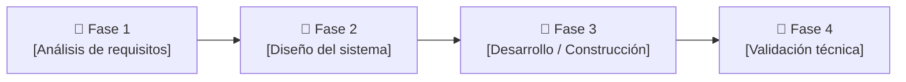
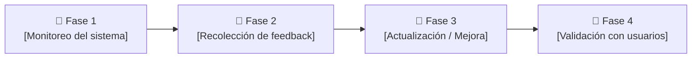

# 🔄 Ciclo de Vida del Proyecto:

## Enfoque seleccionado 

> **HÍBRIDO**

## Justificación de la elección

>En la etapa de producción se adopta un enfoque iterativo debido a que el proyecto presenta un nivel alto de incertidumbre y complejidad, lo que dificulta definir completamente los requisitos desde el inicio. En este contexto, los objetivos y características del producto se van definiendo progresivamente a medida que se obtiene nueva información a lo largo del desarrollo.
>
> Además, el proyecto requiere la construcción de prototipos o versiones parciales que permitan validar ideas, funcionalidades y decisiones de diseño. Esto implica que el desarrollo no sigue una secuencia rígida, sino que se organiza en ciclos sucesivos donde cada iteración aporta aprendizaje y permite realizar ajustes, reduciendo así el riesgo de errores en etapas avanzadas.
>
> Por otro lado, la retroalimentación de los interesados cumple un rol fundamental, ya que cada versión del producto es evaluada y utilizada para mejorar la siguiente. Esto resulta especialmente importante cuando existen múltiples perspectivas o cuando las necesidades pueden evolucionar con el tiempo, haciendo necesario un enfoque flexible y adaptable.
>
> Finalmente, aunque este enfoque puede implicar mayores tiempos y costos, permite obtener un producto final más alineado con las expectativas y necesidades reales, siendo especialmente adecuado en contextos donde el aprendizaje continuo y la adaptación son clave para el éxito del proyecto.

## Árbol de decisión

```mermaid
flowchart TD
    A{{"¿Los requisitos\nson estables?"}}
    B{{"¿El equipo tiene\nexperiencia en ágil?"}}
    C{{"¿El entorno admite\nentregas incrementales?"}}

    A -- Sí --> P["✅ Predictivo\n(Cascada)"]
    A -- No --> B
    B -- Sí --> D["✅ Adaptativo\n(Scrum / Kanban)"]
    B -- No --> C
    C -- Sí --> H["✅ Híbrido"]
    C -- No --> P

    style P fill:#1E3A5F,stroke:#64B5F6
    style D fill:#1B5E20,stroke:#81C784
    style H fill:#5D4037,stroke:#FFB74D
```

> **Decisión del grupo:** La rama del arbol que aplica a la primer etapa es la ADAPTATIVA, ya que los requisitos para construir el programa en realidad virtual no son estables porque durante el desarrollo se mostrará el sofyware a los usuarios los cuales podran realizar aportes para mejorar el proyecto. Además, el equipo se presume que tiene experiencia en ágil, ya que su mentalidad está basada en los valores y principios del manifiesto ágil. Dentro de la rama adaptativa se determina que el enfoque es del tipo SCRUM, ya que el equipo trabaja en iteraciones de duración fija facilitando una estructura de revisión constante con los asesores médicos.

## Fases del proyecto

```mermaid
flowchart LR
    F1["📌 Fase 1\n[Análisis de requisitos]"]
    F2["📌 Fase 2\n[Diseño del sistema]"]
    F3["📌 Fase 3\n[Desarrollo / Construcción]"]
    F4["📌 Fase 4\n[Validación técnica]"]

    F1 --> F2 --> F3 --> F4 
```
| Fase | Nombre | Objetivo | Criterio de salida |
|------|--------|----------|-------------------|
| 1 | Análisis de requisitos | Definir las necesidades del sistema junto con el asesor médico | Requisitos documentados y validados |
| 2 | Diseño del sistema | Establecer la arquitectura, algoritmos y funcionamiento del equipo| Diseño aprobado |
| 3 | Desarrollo / Construcción | Implementar y crear el código según el diseño | Prototipo funcional del entorno |
| 4 | Validación técnica | Verificar que el sistema cumpla con los requisitos definidos | Sistema validado por el asesor médico |

---

## Fases del proyecto

```mermaid
flowchart LR
    F1["📌 Fase 1\n[Monitoreo del sistema]"]
    F2["📌 Fase 2\n[Recolección de feedback]"]
    F3["📌 Fase 3\n[Actualización / Mejora]"]
    F4["📌 Fase 4\n[Validación con usuarios]"]

    F1 --> F2 --> F3 --> F4
```

| Fase | Nombre | Objetivo | Criterio de salida |
|------|--------|----------|-------------------|
| 1 | Monitoreo del sistema | Evaluar el desempeño del sistema en uso real | Datos de uso y problemas identificados |
| 2 | Recolección de feedback | Obtener sugerencias y necesidades de los usuarios | Feedback documentado |
| 3 | Actualización / Mejora | Implementar cambios y mejoras en el sistema | Versión actualizada del sistema |
| 4 | Validación con usuarios | Verificar que las mejoras resuelvan los problemas detectados | Aprobación de los usuarios y correcto funcionamiento |

---

*Cátedra Gestión de Proyectos · FIUNER · 2026*
