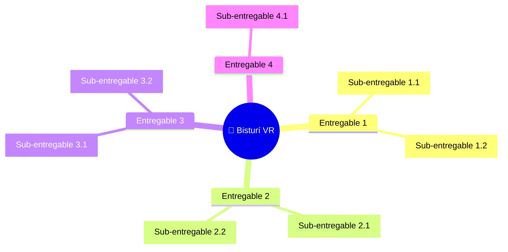

# 📦 Entregables Principales del Proyecto

## Lista de entregables

## Detalle de entregables

| # | Entregable | Descripción | Responsable | Criterio de aceptación | Hito |
|---|-----------|-------------|------------|------------------------|----|
| 1 | Plan de Desarrollo | Plan y Cronograma de Tareas | [COMPLETAR] | [COMPLETAR] | Fin de Semana 2 |
| 2 | Plan Presupuestario | Planificación de Presupuesto y Proveedores | [COMPLETAR] | [COMPLETAR] | Fin de Semana 2 |
| 3 | Prototipo de Interfaz | Primer Mockup Navegable. | [COMPLETAR] | [COMPLETAR] |Fin de Semana 4|
| 4 | Asesoramiento Médico n° 1 | Pruebas y Retroalimentación Médica. | [COMPLETAR] | [COMPLETAR] |Fin de Semana 5|
| 5 | Actualización de Producto | Realización de Mejoras. | [COMPLETAR] | [COMPLETAR] |Fin de Semana 6|
| 6 | Asesoramiento Médico n° 2 | Pruebas y Retroalimentación Médica. | [COMPLETAR] | [COMPLETAR] |Fin de Semana 7|
| 7 | Actualización de Producto | Realización de Mejoras. | [COMPLETAR] | [COMPLETAR] |Fin de Semana 8|
| 8 | Asesoramiento Médico n° 3 | Pruebas y Retroalimentación Médica. | [COMPLETAR] | [COMPLETAR] |Fin de Semana 9|
| 9 | Actualización de Producto Final | Realización de mejoras. | [COMPLETAR] | [COMPLETAR] |Fin de Semana 10|
| 10 | Plan de Marketing | Planificación de Publicidad y Difusión. | [COMPLETAR] | [COMPLETAR] |Fin de Semana 10|
| 11 | Ejecución de Plan de Marketing | Llevar a cabo el Plan de Marketing. | [COMPLETAR] | [COMPLETAR] |Fin de Semana 11|
| 12 | Lanzamiento del Producto al Público. | Búsqueda de Posibles Usuarios. | [COMPLETAR] | [COMPLETAR] |Fin de Semana 11|

## Exclusiones del alcance

> [COMPLETAR: indicar explícitamente qué NO está incluido en el proyecto para evitar ambigüedades]

- [COMPLETAR: exclusión 1]
- [COMPLETAR: exclusión 2]

---

*Cátedra Gestión de Proyectos · FIUNER · 2026*
