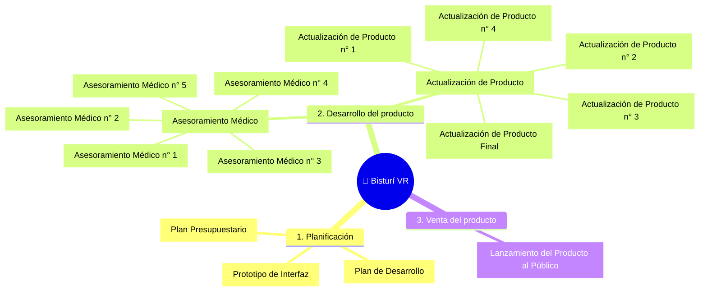

# 📦 Entregables Principales del Proyecto

## Lista de entregables

```mermaid
mindmap
  root(("🏥 Bisturí VR"))
    1. Planificación
      [Plan de Desarrollo]
      [Plan Presupuestario]
      [Prototipo de Interfaz]
    2. Desarrollo del producto
      [Asesoramiento Médico]
        [Asesoramiento Médico n° 1]
        [Asesoramiento Médico n° 2]
        [Asesoramiento Médico n° 3]
        [Asesoramiento Médico n° 4]
        [Asesoramiento Médico n° 5]
      [Actualización de Producto]
        [Actualización de Producto n° 1]
        [Actualización de Producto n° 2]
        [Actualización de Producto n° 3]
        [Actualización de Producto n° 4]
        [Actualización de Producto Final]
    3. Venta del producto
      [Lanzamiento del Producto al Público]
    
```

## Detalle de entregables

| # | Entregable | Descripción | Responsable | Criterio de aceptación | Hito |
|---|-----------|-------------|------------|------------------------|----|
| 1 | Plan de Desarrollo | Plan y Cronograma de Tareas | Director de Proyecto | [COMPLETAR] | Fin de Semana 2 |
| 2 | Plan Presupuestario | Planificación de Presupuesto y Proveedores | Gestor de Finanzas| [COMPLETAR] | Fin de Semana 2 |
| 3 | Prototipo de Interfaz | Primer Mockup Navegable. | Área de Desarrollo de Software | [COMPLETAR] |Fin de Semana 6|
| 4 | Asesoramiento Médico n° 1 | Pruebas y Retroalimentación Médica. | Asesor Médico | [COMPLETAR] |Fin de Semana 7|
| 5 | Actualización de Producto n° 1 | Realización de Mejoras. | Área de Desarrollo de Software  | [COMPLETAR] |Fin de Semana 9|
| 6 | Asesoramiento Médico n° 2 | Pruebas y Retroalimentación Médica. | Asesor Médico | [COMPLETAR] |Fin de Semana 10|
| 7 | Actualización de Producto n° 2 | Realización de Mejoras. | Área de Desarrollo de Software  | [COMPLETAR] |Fin de Semana 12|
| 8 | Asesoramiento Médico n° 3 | Pruebas y Retroalimentación Médica. | Asesor Médico | [COMPLETAR] |Fin de Semana 13|
| 9 | Actualización de Producto n° 3 | Realización de mejoras. | Área de Desarrollo de Software  | [COMPLETAR] |Fin de Semana 15|
| 10 | Asesoramiento Médico n° 4 | Pruebas y Retroalimentación Médica. | Asesor Médico | [COMPLETAR] |Fin de Semana 16|
| 11 | Actualización de Producto n° 4 | Realización de mejoras. | Área de Desarrollo de Software  | [COMPLETAR] |Fin de Semana 18|
| 13 | Asesoramiento Médico n° 5 | Pruebas y Retroalimentación Médica. | Asesor Médico | [COMPLETAR] |Fin de Semana 19|
| 14 | Actualización Final de Producto | Realización de mejoras. | Area de Desarrollo de Software  | [COMPLETAR] |Fin de Semana 21|
| 15 | Asesoramiento Médico final | Verificación final de funcionamiento correcto | [COMPLETAR] |Fin de Semana 22|

## Exclusiones del alcance

- No se desarrollará un sistema apto para su uso en cirugías reales.
- No se integrará con hardware médico real ni con sistemas quirúrgicos del Da Vinci Surgical System.
- No se integrará con bases de datos externas ni sistemas hospitalarios. 

---

*Cátedra Gestión de Proyectos · FIUNER · 2026*
