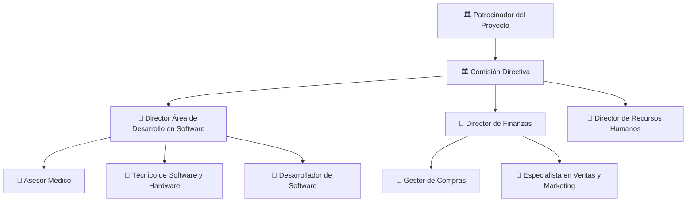

# 🏢 Organización del Proyecto

## Usuarios e interesados (Stakeholders)

| Nombre / Rol | Área | Interés en el proyecto | Influencia |
|---------------------------------------------|-------|--------------------------------------|------|
| Centros de entrenamiento en cirugía robótica| Salud | Formación y entrenamiento de médicos | Alta |

## Áreas involucradas

| Área                             | Rol en el proyecto                              |
|----------------------------------|-------------------------------------------------|
| Desarrollo de Software | implementación técnica del sistema, encargándose de la creación del entorno virtual inmersivo, la programación de las funcionalidades y el soporte de los equipos de VR |
| Asesoría Médica | garantizan la precisión médica de las simulaciones y validar cada prototipo mediante retroalimentación constante para asegurar la "correctitud" de la solución |
| Área de Finanzas y Administración | gestión de recursos y costos, asegurando la viabilidad económica del proyecto, administrando el presupuesto y coordinando la adquisición de insumos tecnológicos necesarios |
| Dirección de Proyecto | defininen los procesos, establecen prioridades, gestionan los conflictos y aseguran que todos los miembros comprendan sus responsabilidades |
| Recursos Humanos| Se enfoca en el desarrollo de los miembros del equipo, fomentando una cultura de apoyo, respeto y motivación para que el grupo evolucione hacia un equipo de alto rendimiento |
| Área de Ventas y Marketing | Responsable de posicionar el producto en el mercado y asegurar que el desarrollo se mantenga enfocado en generar beneficios de negocio y resultados para los interesados |
| Área de Compras |  Gestiona la relación con los proveedores y la adquisición de los recursos tecnológicos y materiales necesarios en tiempo y forma |
 

## Equipo de proyecto
| Integrante                         | Rol en el proyecto        | Responsabilidad principal                                              |
|----------------------------------|--------------------------|------------------------------------------------------------------------|
|      COMPLETAR          | Patrocinador del Proyecto             | Tiene la autoridad para asignar recursos, aprobar presupuestos y tomar decisiones esenciales. También puede proporcionar recursos y garantizar que el proyecto entregue el valor empresarial esperado. |
|      COMPLETAR          | Comisión Directiva             | Asegurar el éxito del proyecto y el cumplimiento de los objetivos estratégicos |
| COMPLETAR      | Director Área de Desarrollo de software           | Lograr un desarrollo eficiente, funcional y de calidad del sistema     |
| COMPLETAR                 | Asesor médico      | Garantizar la precisión médica y utilidad de las simulaciones          |
| COMPLETAR    | Técnico de Software          | Mantener el correcto funcionamiento de los equipos y sistemas          |
| COMPLETAR        | Desarrollador de Software     | Implementar correctamente las funcionalidades del sistema              |
| COMPLETAR     | Director de Recursos Humanos        | Gestionar el equipo de trabajo y su desempeño                          |
| COMPLETAR             | Director de Finanzas       | Controlar costos y asegurar la viabilidad económica                    |
| COMPLETAR| Especialista en Ventas / Marketing  | Posicionar el producto y atraer clientes potenciales                   |
| COMPLETAR                | Gestor de Compras           | Garantizar la adquisición de recursos necesarios en tiempo y forma     |

## Estructura del equipo

---

*Cátedra Gestión de Proyectos · FIUNER · 2026*
