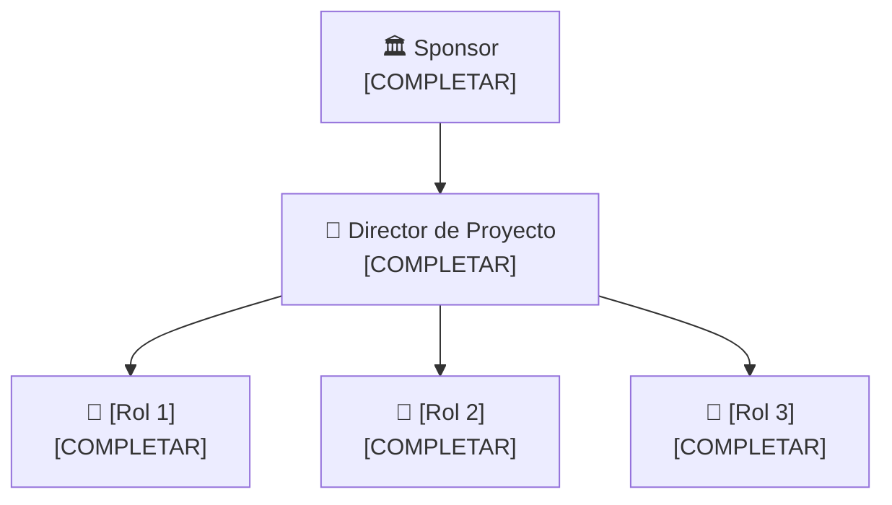

# 🏢 Organización del Proyecto

## Usuarios e interesados (Stakeholders)

| Nombre / Rol | Área | Interés en el proyecto | Influencia |
|---------------------------------------------|-------|--------------------------------------|------|
| Centros de entrenamiento en cirugía robótica| Salud | Formación y entrenamiento de médicos | Alta |

## Áreas involucradas
| Rol | Interés en el proyecto |
|---------------------|-------------------------------------------------------------------------------|
| Comisión Directiva | Asegurar el éxito del proyecto y el cumplimiento de los objetivos estratégicos |
| Director Área de Desarrollo en Software | Lograr un desarrollo eficiente, funcional y de calidad del sistema |
| Asesor Médico | Garantizar la precisión médica y utilidad de las simulaciones |
| Técnico de Software y Hardware | Mantener el correcto funcionamiento de los equipos y sistemas|
| Desarrollador de Software | Implementar correctamente las funcionalidades del sistema | 
| Director de Recursos Humanos | Gestionar el equipo de trabajo y su desempeño | 
| Director de Finanzas | Controlar costos y asegurar la viabilidad económica | 
| Especialista en Ventas y Marketing | Posicionar el producto y atraer clientes potenciales | 
| Gestor de Compras | Garantizar la adquisición de recursos necesarios en tiempo y forma |

## Equipo del proyecto

| Integrante | Rol en el proyecto | Responsabilidad principal |
|------------|--------------------|--------------------------|
| [COMPLETAR] | Director / Líder de Proyecto | [COMPLETAR] |
| [COMPLETAR] | [COMPLETAR] | [COMPLETAR] |
| [COMPLETAR] | [COMPLETAR] | [COMPLETAR] |

## Estructura del equipo

---

*Cátedra Gestión de Proyectos · FIUNER · 2026*
