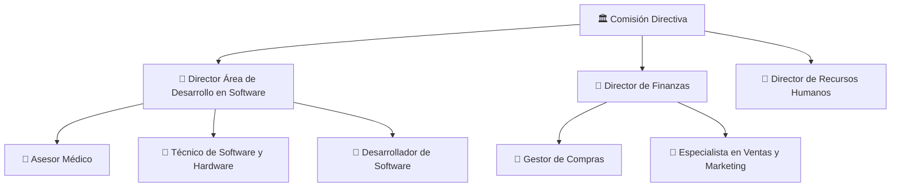

# 🏢 Organización del Proyecto

## Usuarios e interesados (Stakeholders)

| Nombre / Rol | Área | Interés en el proyecto | Influencia |
|---------------------------------------------|-------|--------------------------------------|------|
| Centros de entrenamiento en cirugía robótica| Salud | Formación y entrenamiento de médicos | Alta |

## Áreas involucradas
| Rol | Interés en el proyecto |

## Equipo de proyecto
| Integrante                         | Rol en el proyecto        | Responsabilidad principal                                              |
|----------------------------------|--------------------------|------------------------------------------------------------------------|
| Comisión Directiva               | gestión del proyecto             | Asegurar el éxito del proyecto y el cumplimiento de los objetivos estratégicos |
| Director de Proyecto      | Líder técnico            | Lograr un desarrollo eficiente, funcional y de calidad del sistema     |
| Experto en el área                 | Experto del dominio      | Garantizar la precisión médica y utilidad de las simulaciones          |
| Técnico de Software y Hardware   | Soporte técnico          | Mantener el correcto funcionamiento de los equipos y sistemas          |
| Desarrollador de Software        | Equipo de desarrollo     | Implementar correctamente las funcionalidades del sistema              |
| Director de Recursos Humanos     | Gestión de equipo        | Gestionar el equipo de trabajo y su desempeño                          |
| Director de Finanzas             | Control financiero       | Controlar costos y asegurar la viabilidad económica                    |
| Especialista en Ventas y Marketing| Comercial / Marketing   | Posicionar el producto y atraer clientes potenciales                   |
| Gestor de Compras                | Abastecimiento           | Garantizar la adquisición de recursos necesarios en tiempo y forma     |

## Estructura del equipo

---

*Cátedra Gestión de Proyectos · FIUNER · 2026*
