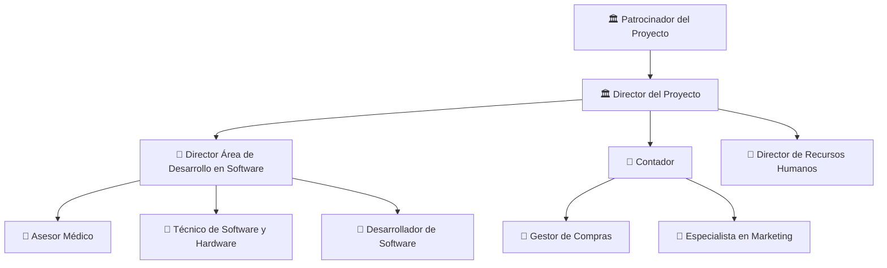

# 🏢 Organización del Proyecto

## Usuarios e interesados (Stakeholders)

| Nombre / Rol | Área | Interés en el proyecto | Influencia |
|---------------------------------------------|-------|--------------------------------------|------|
| Centros de entrenamiento en cirugía robótica| Salud | Formación y entrenamiento de médicos | Alta |

## Áreas involucradas

| Área                             | Rol en el proyecto                              |
|----------------------------------|-------------------------------------------------|
| Desarrollo de Software | implementación técnica del sistema, encargándose de la creación del entorno virtual inmersivo, la programación de las funcionalidades y el soporte de los equipos de VR |
| Asesoría Médica | garantizan la precisión médica de las simulaciones y validar cada prototipo mediante retroalimentación constante para asegurar la "correctitud" de la solución |
| Dirección de Proyecto | defininen los procesos, establecen prioridades, gestionan los conflictos y aseguran que todos los miembros comprendan sus responsabilidades |
| Área de Finanzas |  Gestiona la relación con los proveedores y la adquisición de los recursos tecnológicos y materiales necesarios en tiempo y forma |
 

## Equipo de proyecto
| Integrante                         | Rol en el proyecto        | Responsabilidad principal                                              |
|----------------------------------|--------------------------|------------------------------------------------------------------------|
|      COMPLETAR          | Patrocinador del Proyecto             | Tiene la autoridad para asignar recursos, aprobar presupuestos y tomar decisiones esenciales. También puede proporcionar recursos y garantizar que el proyecto entregue el valor empresarial esperado. |
|      COMPLETAR          | Director del Proyecto             | Tiene total responsabilidad por el éxito del proyecto y el poder para tomar todas las decisiones, sujeto a la supervisión de los órganos ejecutivos. |
| COMPLETAR      | Director Área de Desarrollo de software           | Busca lograr un desarrollo eficiente, funcional y de calidad del sistema     |
| COMPLETAR                 | Asesor médico      | Garantiza la precisión médica y utilidad de las simulaciones          |
| COMPLETAR    | Técnico de Software          | Mantiene el correcto funcionamiento de los equipos y sistemas          |
| COMPLETAR        | Desarrollador de Software     | Implementar correctamente las funcionalidades del sistema              |
| COMPLETAR             | Gestor de Finanzas       | Asegura la viabilidad económica                    |

## Estructura del equipo

```mermaid
graph TD
    Z["🏛️ Patrocinador del Proyecto"]
    A["🏛️ Director del Proyecto"]

    B["👤 Director Área de Desarrollo en Software"]
    C["👤 Contador"]
    D["👤 Director de Recursos Humanos"]

    E["👤 Asesor Médico"]
    F["👤 Técnico de Software y Hardware"]
    G["👤 Desarrollador de Software"]

    H["👤 Gestor de Compras"]
    I["👤 Especialista en Marketing"]

    Z --> A
    A --> B
    A --> C
    A --> D

    B --> E
    B --> F
    B --> G

    C --> H
    C --> I
```
---

*Cátedra Gestión de Proyectos · FIUNER · 2026*
