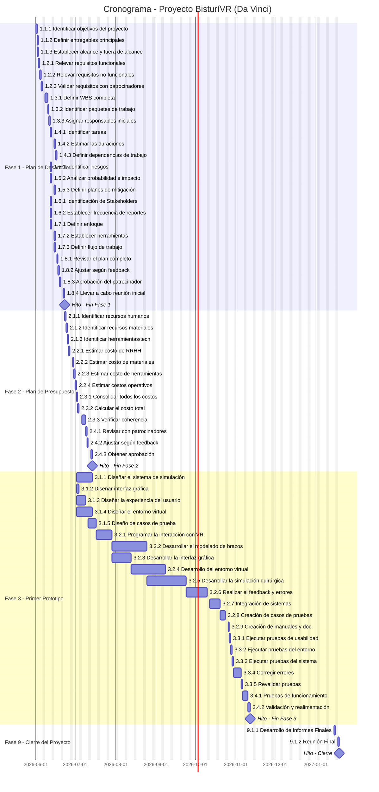

# 📅 Cronograma del Proyecto

## Diagrama de Gantt

## Tabla de tareas

| ID | Tarea | Predecesoras | Responsable | Duración (días) | Inicio | Fin | Hito |
| --- | --- | --- | --- | --- | --- | --- | --- |
| 1.1.1 | Identificar objetivos del proyecto | — | Director del Proyecto | 1 | 2026-06-01 | 2026-06-01 | No |
| 1.1.2 | Definir entregables principales | 1.1.1 | Director del Proyecto | 1 | 2026-06-02 | 2026-06-02 | No |
| 1.1.3 | Establecer alcance y fuera de alcance | 1.1.1 | Director del Proyecto | 1 | 2026-06-02 | 2026-06-02 | No |
| 1.2.1 | Relevar requisitos funcionales | — | Director del Proyecto | 1 | 2026-06-03 | 2026-06-03 | No |
| 1.2.2 | Relevar requisitos no funcionales | 1.2.1 | Director del Proyecto | 1 | 2026-06-04 | 2026-06-04 | No |
| 1.2.3 | Validar requisitos con patrocinadores | 1.2.2 | Director del Proyecto | 1 | 2026-06-05 | 2026-06-05 | No |
| 1.3.1 | Definir WBS completa | 1.2.3 | Director del Proyecto | 2 | 2026-06-08 | 2026-06-09 | No |
| 1.3.2 | Identificar paquetes de trabajo | 1.3.1 | Director del Proyecto | 1 | 2026-06-10 | 2026-06-10 | No |
| 1.3.3 | Asignar responsables iniciales | 1.3.2 | Director del Proyecto | 1 | 2026-06-11 | 2026-06-11 | No |
| 1.4.1 | Identificar tareas | — | Director del Proyecto | 1 | 2026-06-12 | 2026-06-12 | No |
| 1.4.2 | Estimar las duraciones | 1.4.1 | Director del Proyecto | 1 | 2026-06-15 | 2026-06-15 | No |
| 1.4.3 | Definir dependencias de trabajo | 1.4.2 | Director del Proyecto | 1 | 2026-06-16 | 2026-06-16 | No |
| 1.5.1 | Identificar riesgos | — | Analista | 1 | 2026-06-12 | 2026-06-12 | No |
| 1.5.2 | Analizar probabilidad e impacto | — | Analista | 1 | 2026-06-12 | 2026-06-12 | No |
| 1.5.3 | Definir planes de mitigación | 1.5.1, 1.5.2 | Analista | 1 | 2026-06-15 | 2026-06-15 | No |
| 1.6.1 | Identificación de Stakeholders | 1.3.3 | Director del Proyecto | 1 | 2026-06-12 | 2026-06-12 | No |
| 1.6.2 | Establecer frecuencia de reportes | — | Director del Proyecto | 1 | 2026-06-12 | 2026-06-12 | No |
| 1.7.1 | Definir enfoque | — | Director del Proyecto | 1 | 2026-06-12 | 2026-06-12 | No |
| 1.7.2 | Establecer herramientas | 1.7.1 | Director del Proyecto | 1 | 2026-06-15 | 2026-06-15 | No |
| 1.7.3 | Definir flujo de trabajo | 1.7.1 | Director del Proyecto | 1 | 2026-06-16 | 2026-06-16 | No |
| 1.8.1 | Revisar el plan completo | 1.3.3, 1.4.3, 1.5.3, 1.6.1, 1.6.2, 1.7.3 | Director del Proyecto | 1 | 2026-06-17 | 2026-06-17 | No |
| 1.8.2 | Ajustar según feedback | 1.8.1 | Director del Proyecto | 1 | 2026-06-18 | 2026-06-18 | No |
| 1.8.3 | Aprobación del patrocinador | 1.8.2 | Director del Proyecto | 1 | 2026-06-19 | 2026-06-19 | No |
| 1.8.4 | Llevar a cabo reunión inicial | 1.8.3 | Director del Proyecto | 1 | 2026-06-22 | 2026-06-22 | No |
| **M1** | 🏁 Fin Fase 1 | 1.8.4 | — | 0 | 2026-06-22 | 2026-06-22 | **Sí** |
| 2.1.1 | Identificar recursos humanos | M1 | Gestor de Finanzas | 1 | 2026-06-23 | 2026-06-23 | No |
| 2.1.2 | Identificar recursos materiales | 2.1.1 | Gestor de Finanzas | 1 | 2026-06-23 | 2026-06-23 | No |
| 2.1.3 | Identificar herramientas/tech | 2.1.2 | Gestor de Finanzas | 1 | 2026-06-23 | 2026-06-23 | No |
| 2.2.1 | Estimar costo de RRHH | 2.1.3 | Gestor de Finanzas | 1 | 2026-06-24 | 2026-06-24 | No |
| 2.2.2 | Estimar costo de materiales | 2.2.1 | Gestor de Finanzas | 1 | 2026-06-24 | 2026-06-24 | No |
| 2.2.3 | Estimar costo de herramientas | 2.2.2 | Gestor de Finanzas | 1 | 2026-06-25 | 2026-06-25 | No |
| 2.2.4 | Estimar costos operativos | 2.2.3 | Sin asignar | 1 | 2026-06-25 | 2026-06-25 | No |
| 2.3.1 | Consolidar todos los costos | 2.2.4 | Gestor de Finanzas | 1 | 2026-06-26 | 2026-06-26 | No |
| 2.3.2 | Calcular el costo total | 2.3.1 | Gestor de Finanzas | 1 | 2026-06-26 | 2026-06-26 | No |
| 2.3.3 | Verificar coherencia | 2.3.2 | Director de Área Contable | 3 | 2026-06-27 | 2026-06-29 | No |
| 2.4.1 | Revisar con patrocinadores | 2.3.3 | Director de Proyecto | 1 | 2026-06-30 | 2026-06-30 | No |
| 2.4.2 | Ajustar según feedback | 2.4.1 | Gestor de Finanzas | 1 | 2026-06-30 | 2026-06-30 | No |
| 2.4.3 | Obtener aprobación | 2.4.2 | Director de Proyecto | 1 | 2026-07-01 | 2026-07-01 | No |
| **M2** | 🏁 Fin Fase 2 | 2.4.3 | — | 0 | 2026-07-01 | 2026-07-01 | **Sí** |
| 3.1.1 | Diseñar el sistema de simulación | M2 | Programador de simulación física | 8 | 2026-07-02 | 2026-07-09 | No |
| 3.1.2 | Diseñar interfaz gráfica | M2 | Programador de VR / gráficos | 2 | 2026-07-02 | 2026-07-03 | No |
| 3.1.3 | Diseñar la experiencia del usuario | M2 | Programador de soporte general y desarrollo | 5 | 2026-07-02 | 2026-07-06 | No |
| 3.1.4 | Diseñar el entorno virtual | M2 | Programador de VR / gráficos | 8 | 2026-07-02 | 2026-07-09 | No |
| 3.1.5 | Diseño de casos de prueba | 3.1.1, 3.1.2, 3.1.3, 3.1.4 | Programador de soporte general y desarrollo | 5 | 2026-07-11 | 2026-07-15 | No |
| 3.2.1 | Programar la interacción con VR | 3.1.5 | Programador de VR / gráficos | 8 | 2026-07-16 | 2026-07-23 | No |
| 3.2.2 | Desarrollar el modelado de brazos robóticos | 3.2.1 | Programador de robótica y control | 19 | 2026-07-24 | 2026-08-11 | No |
| 3.2.3 | Desarrollar la interfaz gráfica | 3.2.1 | Programador de VR / gráficos | 11 | 2026-07-24 | 2026-08-03 | No |
| 3.2.4 | Desarrollo del entorno virtual | 3.2.3 | Programador de VR / gráficos | 18 | 2026-08-04 | 2026-08-21 | No |
| 3.2.5 | Desarrollar la simulación quirúrgica | 3.2.2 | Programador de simulación física | 22 | 2026-08-12 | 2026-09-02 | No |
| 3.2.6 | Realizar el feedback y detección de errores | 3.2.5 | Programador de IA | 12 | 2026-09-03 | 2026-09-14 | No |
| 3.2.7 | Integración de sistemas | 3.2.4, 3.2.6 | Programador de soporte general y desarrollo | 6 | 2026-09-15 | 2026-09-20 | No |
| 3.2.8 | Creación de casos de pruebas | 3.2.7 | Programador de soporte general y desarrollo | 4 | 2026-09-21 | 2026-09-24 | No |
| 3.2.9 | Creación de manuales y documentación | 3.2.8 | Programador de soporte general y desarrollo | 1 | 2026-09-25 | 2026-09-25 | No |
| 3.3.1 | Ejecutar pruebas de usabilidad | 3.2.9 | Programador de soporte general y desarrollo | 1 | 2026-09-28 | 2026-09-28 | No |
| 3.3.2 | Ejecutar pruebas del entorno | 3.3.1 | Programador de soporte general y desarrollo | 1 | 2026-09-29 | 2026-09-29 | No |
| 3.3.3 | Ejecutar pruebas del sistema | 3.3.2 | Programador de soporte general y desarrollo | 1 | 2026-09-30 | 2026-09-30 | No |
| 3.3.4 | Corregir errores | 3.3.3 | Programador de soporte general y desarrollo | 4 | 2026-10-01 | 2026-10-04 | No |
| 3.3.5 | Revalidar pruebas | 3.3.4 | Programador de soporte general y desarrollo | 1 | 2026-10-05 | 2026-10-05 | No |
| 3.4.1 | Pruebas de funcionamiento | 3.3.5 | Asesor Médico | 2 | 2026-10-06 | 2026-10-07 | No |
| 3.4.2 | Validación y realimentación | 3.4.1 | Asesor Médico | 2 | 2026-10-08 | 2026-10-09 | No |
| **M3** | 🏁 Fin Fase 3 | 3.4.2 | — | 0 | 2026-10-09 | 2026-10-09 | **Sí** |
| 9.1.1 | Desarrollo de Informes Finales | T8.3.2 | Director del Proyecto | 1 | 2027-01-15 | 2027-01-15 | No |
| 9.1.2 | Reunión Final | 9.1.1 | Director del Proyecto | 1 | 2027-01-18 | 2027-01-18 | No |
| **M9** | 🏁 Fin Fase 9 | 9.1.2 | — | 0 | 2027-01-18 | 2027-01-18 | **Sí** |

---

*Cátedra Gestión de Proyectos*
