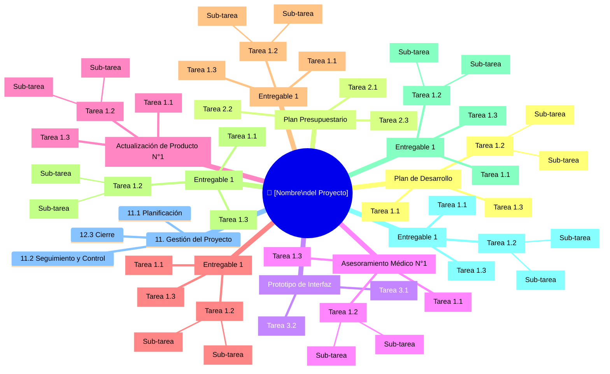

# 🌳 Work Breakdown Structure (WBS)

## Diagrama WBS

## Diccionario de la WBS

| ID | Nombre de la tarea | Entregable asociado | Descripción | Criterio de completitud |
|----|-------------------|---------------------|-------------|------------------------|
| 1.1 | [COMPLETAR] | [COMPLETAR] | [COMPLETAR] | [COMPLETAR] |
| 1.2 | [COMPLETAR] | [COMPLETAR] | [COMPLETAR] | [COMPLETAR] |
| 1.3 | [COMPLETAR] | [COMPLETAR] | [COMPLETAR] | [COMPLETAR] |
| 2.1 | [COMPLETAR] | [COMPLETAR] | [COMPLETAR] | [COMPLETAR] |
| 2.2 | [COMPLETAR] | [COMPLETAR] | [COMPLETAR] | [COMPLETAR] |
| 2.3 | [COMPLETAR] | [COMPLETAR] | [COMPLETAR] | [COMPLETAR] |
| 3.1 | [COMPLETAR] | [COMPLETAR] | [COMPLETAR] | [COMPLETAR] |
| 3.2 | [COMPLETAR] | [COMPLETAR] | [COMPLETAR] | [COMPLETAR] |

---

## Diccionario de la WBS

| ID | Nombre de la sub-tarea | Entregable asociado | Descripción | Criterio de completitud |
|----|-------------------|---------------------|-------------|------------------------|
| 1.1.1 | Identificar objetivos del proyecto | [COMPLETAR] | [COMPLETAR] | [COMPLETAR] |
| 1.1.2 | Definir entregables principales | [COMPLETAR] | [COMPLETAR] | [COMPLETAR] |
| 1.1.3 | Establecer alcance y fuera de alcance | [COMPLETAR] | [COMPLETAR] | [COMPLETAR] |
| 1.2.1 |  Relevar requisitos funcionales | [COMPLETAR] | [COMPLETAR] | [COMPLETAR] |
| 1.2.2 |  Relevar requisitos no funcionales | [COMPLETAR] | [COMPLETAR] | [COMPLETAR] |
| 1.2.3 | Validar requisitos con stakeholders | [COMPLETAR] | [COMPLETAR] | [COMPLETAR] |
| 1.3.1 | Definir WBS completa | [COMPLETAR] | [COMPLETAR] | [COMPLETAR] |
| 1.3.2 | Identificar paquetes de trabajo | [COMPLETAR] | [COMPLETAR] | [COMPLETAR] |
| 1.3.3 | Asignar responsables iniciales | [COMPLETAR] | [COMPLETAR] | [COMPLETAR] |
| 1.4.1 |  Identificar tareas | [COMPLETAR] | [COMPLETAR] | [COMPLETAR] |
| 1.4.2 | Estimar las duraciones | [COMPLETAR] | [COMPLETAR] | [COMPLETAR] |
| 1.4.3 | Definir dependencias de trabajo | [COMPLETAR] | [COMPLETAR] | [COMPLETAR] |
| 1.5.1 | Identificar riesgos | [COMPLETAR] | [COMPLETAR] | [COMPLETAR] |
| 1.5.2 | Analizar probabilidad e impacto | [COMPLETAR] | [COMPLETAR] | [COMPLETAR] |
| 1.5.3 | Definir planes de mitigación | [COMPLETAR] | [COMPLETAR] | [COMPLETAR] |
| 1.6.1 | Identificación de Stakeholders | [COMPLETAR] | [COMPLETAR] | [COMPLETAR] |
| 1.6.2 | Establecer frecuencia de reportes | [COMPLETAR] | [COMPLETAR] | [COMPLETAR] |
| 1.7.1 | Determinar el  enfoque | [COMPLETAR] | [COMPLETAR] | [COMPLETAR] |
| 1.7.2 | Establecer herramientas | [COMPLETAR] | [COMPLETAR] | [COMPLETAR] |
| 1.7.3 | Definir flujo de trabajo | [COMPLETAR] | [COMPLETAR] | [COMPLETAR] |
| 1.8.1 | Revisar el plan completo | [COMPLETAR] | [COMPLETAR] | [COMPLETAR] |
| 1.8.2 | Ajustar según feedback | [COMPLETAR] | [COMPLETAR] | [COMPLETAR] |
| 1.8.3 | Aprobación del patrocinador | [COMPLETAR] | [COMPLETAR] | [COMPLETAR] |
| 2.1.1 | Identificar los recursos humanos necesarios | [COMPLETAR] | [COMPLETAR] | [COMPLETAR] |
| 2.1.2 | Identificar recursos materiales | [COMPLETAR] | [COMPLETAR] | [COMPLETAR] |
| 2.1.3 | Identificar herramientas y tecnologías | [COMPLETAR] | [COMPLETAR] | [COMPLETAR] |
| 2.2.1 | Estimar costo de recursos humanos (horas) | [COMPLETAR] | [COMPLETAR] | [COMPLETAR] |
| 2.2.2 | Estimar el costo de materiales y tecnologías | [COMPLETAR] | [COMPLETAR] | [COMPLETAR] |
| 2.2.3 | Estimar el costo de herramientas/licencias | [COMPLETAR] | [COMPLETAR] | [COMPLETAR] |
| 2.2.4 | Estimar costos operativos | [COMPLETAR] | [COMPLETAR] | [COMPLETAR] |
| 2.3.1 | Consolidar todos los costos | [COMPLETAR] | [COMPLETAR] | [COMPLETAR] |
| 2.3.2 | Calcular el costo total del proyecto | [COMPLETAR] | [COMPLETAR] | [COMPLETAR] |
| 2.3.3 | Verificar coherencia del presupuesto | [COMPLETAR] | [COMPLETAR] | [COMPLETAR] |
| 2.4.1 | Revisar el presupuesto | [COMPLETAR] | [COMPLETAR] | [COMPLETAR] |
| 2.4.2 | Ajustar según feedback | [COMPLETAR] | [COMPLETAR] | [COMPLETAR] |
| 2.4.3 | Obtener aprobación del patrocinador | [COMPLETAR] | [COMPLETAR] | [COMPLETAR] |
| 3.1.1 | Diseñar la Arquitectura | [COMPLETAR] | [COMPLETAR] | [COMPLETAR] |
| 3.1.2 | Diseñar casos de prueba | [COMPLETAR] | [COMPLETAR] | [COMPLETAR] |
| 3.1.3 | Desarrollar del Prototipo | [COMPLETAR] | [COMPLETAR] | [COMPLETAR] |
| 3.2.1 | Desarrollar del Prototipo | [COMPLETAR] | [COMPLETAR] | [COMPLETAR] |
| 3.2.2 | Crear manuales | [COMPLETAR] | [COMPLETAR] | [COMPLETAR] |
| 3.3.1 | Despliegue en diferentes ambientes de prueba | [COMPLETAR] | [COMPLETAR] | [COMPLETAR] |
| 3.3.2 | Ejecución de casos de prueba diseñados | [COMPLETAR] | [COMPLETAR] | [COMPLETAR] |
| 3.3.3 | Generar informe de pruebas | [COMPLETAR] | [COMPLETAR] | [COMPLETAR] |
| 3.4.1 | Pruebas de funcionamiento de usuario | [COMPLETAR] | [COMPLETAR] | [COMPLETAR] |
| 3.4.2 | Validar y realimentar los ajuste del prototipo | [COMPLETAR] | [COMPLETAR] | [COMPLETAR] |
| 4.1.1 | Ajustar a especificación de usuario | [COMPLETAR] | [COMPLETAR] | [COMPLETAR] |
| 4.1.2 | Diseñar la Arquitectura | [COMPLETAR] | [COMPLETAR] | [COMPLETAR] |
| 4.1.3 | Diseñar casos de prueba | [COMPLETAR] | [COMPLETAR] | [COMPLETAR] |
| 1.5.3 | Definir planes de mitigación | [COMPLETAR] | [COMPLETAR] | [COMPLETAR] |
| 1.6.1 | Identificación de Stakeholders | [COMPLETAR] | [COMPLETAR] | [COMPLETAR] |
| 1.6.2 | Establecer frecuencia de reportes | [COMPLETAR] | [COMPLETAR] | [COMPLETAR] |
| 1.7.1 | Determinar el  enfoque | [COMPLETAR] | [COMPLETAR] | [COMPLETAR] |
| 1.7.2 | Establecer herramientas | [COMPLETAR] | [COMPLETAR] | [COMPLETAR] |
| 1.7.3 | Definir flujo de trabajo | [COMPLETAR] | [COMPLETAR] | [COMPLETAR] |
| 1.8.1 | Revisar el plan completo | [COMPLETAR] | [COMPLETAR] | [COMPLETAR] |
| 1.8.2 | Ajustar según feedback | [COMPLETAR] | [COMPLETAR] | [COMPLETAR] |
| 1.8.3 | Aprobación del patrocinador | [COMPLETAR] | [COMPLETAR] | [COMPLETAR] |
| 2.1.1 | Identificar los recursos humanos necesarios | [COMPLETAR] | [COMPLETAR] | [COMPLETAR] |
| 2.1.2 | Identificar recursos materiales | [COMPLETAR] | [COMPLETAR] | [COMPLETAR] |
| 2.1.3 | Identificar herramientas y tecnologías | [COMPLETAR] | [COMPLETAR] | [COMPLETAR] |
| 2.2.1 | Estimar costo de recursos humanos (horas) | [COMPLETAR] | [COMPLETAR] | [COMPLETAR] |
| 2.2.2 | Estimar el costo de materiales y tecnologías | [COMPLETAR] | [COMPLETAR] | [COMPLETAR] |
| 2.2.3 | Estimar el costo de herramientas/licencias | [COMPLETAR] | [COMPLETAR] | [COMPLETAR] |
| 2.2.4 | Estimar costos operativos | [COMPLETAR] | [COMPLETAR] | [COMPLETAR] |
| 2.3.1 | Consolidar todos los costos | [COMPLETAR] | [COMPLETAR] | [COMPLETAR] |
| 2.3.2 | Calcular el costo total del proyecto | [COMPLETAR] | [COMPLETAR] | [COMPLETAR] |
| 2.3.3 | Verificar coherencia del presupuesto | [COMPLETAR] | [COMPLETAR] | [COMPLETAR] |
| 2.4.1 | Revisar el presupuesto | [COMPLETAR] | [COMPLETAR] | [COMPLETAR] |
| 2.4.2 | Ajustar según feedback | [COMPLETAR] | [COMPLETAR] | [COMPLETAR] |
| 2.4.3 | Obtener aprobación del patrocinador | [COMPLETAR] | [COMPLETAR] | [COMPLETAR] |

---

*Cátedra Gestión de Proyectos · FIUNER · 2026*
